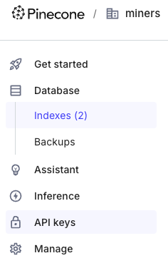
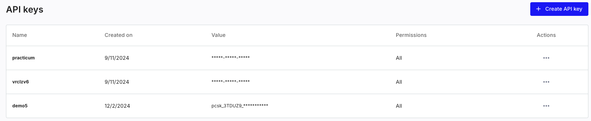
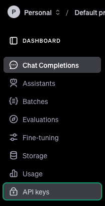
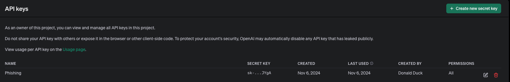
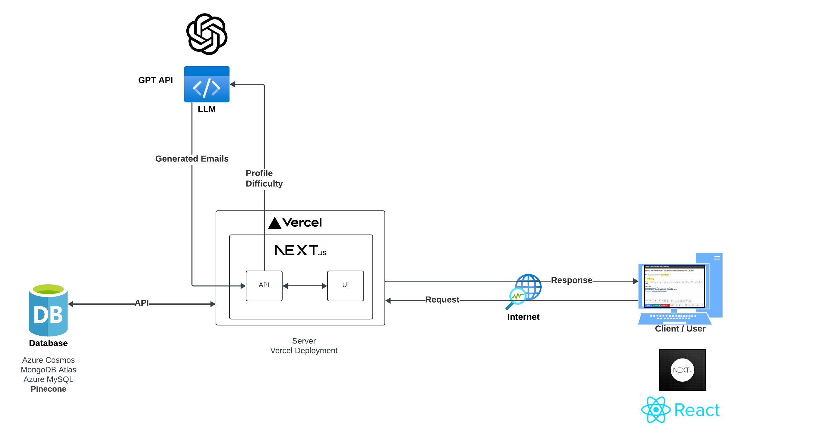
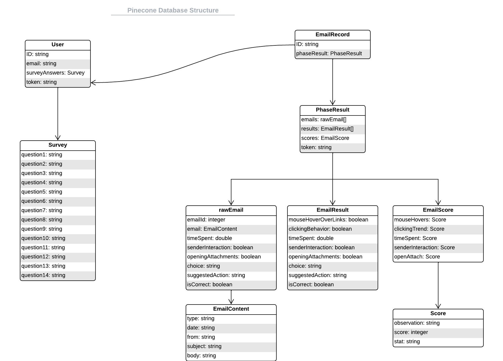

# **Go Phish!**
---

## *Table of Contents*

1. [Installation](#Installation)
2. [Introduction](#Introduction)
	- [Purpose](#Purpose)
	- [Framework](#Framework)
	- [References](#References)
3. [Design](#Design)
	- [Overview](#Overview)
	- [Database Design](#Database-Design)

---


## Installation

---

This software is very easy to use and install! This software does have dependencies before you try and install this software:

#### Dependencies

```
"@floating-ui/react-dom": "^2.1.2",  
"@huggingface/inference": "^2.8.1",  
"@pinecone-database/pinecone": "^3.0.3",  
"bootstrap": "^5.3.3",  
"classnames": "^2.5.1",  
"datasets": "^0.1.0",  
"dotenv": "^16.4.5",  
"html-react-parser": "^5.1.18",  
"js-cookie": "^3.0.5",  
"jsonwebtoken": "^9.0.2",  
"next": "^14.2.14",  
"next-auth": "^4.24.8",  
"openai": "^4.72.0",  
"pinecone": "^0.1.0",  
"pip": "^0.0.1",  
"postcss": "^8.4.47",  
"postcss-preset-env": "^9.6.0",  
"react": "^18.3.1",  
"react-dom": "^18.3.1",  
"react-icons": "^5.2.1",  
"sass": "^1.77.6",  
"sharp": "^0.33.4",  
"survey-react-ui": "^1.12.3",  
"transformers": "^3.1.0",  
"zod": "^3.23.8" 
```

This should already be taken care of during the installation procedure, but here are the references in case you need them for reference. You'll need to make sure you have [`npm`](https://www.npmjs.com/) installed to manage these packages. 

---

#### Pre-Installation

First, you'll need a few things to integrate this software. This requires a Pinecone and an OpenAI account to get the API keys needed to access the database and AI to generate the emails. 

- Create a Pinecone account [here](https://app.pinecone.io/?sessionType=signup)
- Create an OpenAI account [here](https://platform.openai.com/signup/)

Once you've created your accounts you'll need to create and grab your API keys and insert them into your `.env` file of the software

- Pinecone API key
	1. In the dashboard, click on the **API keys** in the side Navbar
		
		
	1. Click **Create API key**
		
		
	1. After name and create your key, copy and store the key somewhere because you will ***not be*** able to do this again later
- OpenAI API key
	1. In the dashboard, click the **API keys** in the side Navbar
		
		
	1. Click **Create new secret key**
		
	3. After name and create your key, copy and store the key somewhere safe because you ***will not*** be able to do this again

After you have your API keys, go to the `.env` file in your root directory and place your keys in their respective variables:


Now that've you setup your resources, you should be ready to install!

---

#### Installation

1. In your terminal, clone the repository:
	- `git clone https://github.com/srleoford/generativeAI_Phishing.git`
2. Change into the `src` directory:
	- `cd generativeAI_Phishing/src`
3. Install the dependencies and software:
	- `npm install`
		- Alternative: you can use `pnpm` which is a more efficient version of `npm` if you'd like
			- `npm install -g pnpm`
			- Using `pnpm` to install: `pnpm i`
4. Run the software
	- `npm run dev`
5. It's deployed! 
	- This only a local deployment for development but the Next.js infrastructure does allow for deployment. This can be done by creating a [Vercel account](https://vercel.com/signup) and deploying 

---


## Introduction

---
#### Purpose

Phishing has and is still a very effective tool to hack into the lives of people. The issue is in teaching people effectively how to spot the signs of phishing emails and train people how to learn from these signs. Part of the effectiveness is a system's ability to capture the focus and attention of the users through interactivity and engagement during the usage. Another issue is that there's still ongoing research into phishing and what makes them so effective across multiple demographics. Certain metrics need to be recorded as a baseline for each user to further quantify and establish ground truths for further study. There needs to be a means to store these training results along with the emails and metrics to help train and discover underlying relationships among these factors. Lastly, an issue with training is the available resources for phishing training (constructing emails, both legitimate and phishing, the database to store and learn, tested results, etc.) Go Phish! is meant to be a easy-to-use, efficient means to complete all three objectives with more novel approaches: the use of vector databases alongside artificial intelligence to generate emails on a case-by-case bases.

In today's day and age with the prevalence of AI, ML, LLM, etc., it's important to leverage these tools to our everyday tasks, so in this spirit, we've come up with a novel approach to utilizing AI to generate phishing emails specifically for training and research using **chatGPT 4.0 Mini** model. For this project, we'll show the framework we chose for this project, how we designed the frontend and the backend of the product, breakdown of the file structure, small demonstration of the product, and resources you might need to reference

#### Framework

Our criteria for what's needed in this system is an optimized and efficient user interface that retains attention and engagement from the users, ease of use for all current and future development of the software, easier integration with AI components with capabilities of using other unconventional AI methods such as HuggingFace models, and optimum usage of a database that's built to house all the data necessary. Considering these main requirements, we've opted to build this system using

1. [Next.js](https://nextjs.org/) and [OpenAI](https://openai.com/) for the functionality
2. [OnceUI](https://once-ui.com/) for the user interface design
3. [Pinecone](https://www.pinecone.io/) database for the backend. 

One of the key requirements for this system is that it retains attention and engagement from the users. Most websites are employed with React because it breaks down web pages into customized, reusable components, mechanisms like hooks and state management for interactivity, and a bunch of other features. One option to employ React is through a framework which is also very popular, but has it's own issues in development and optimization. For this reason, numerous frameworks have been developed to use React and the best choice we found was with Next.js. We wanted to use something that's more modern and satisfies most of the engagement necessary for websites (i.e., high performance and efficient rendering and processing) while also making it easier for the team to develop for the future. It's an open-source framework and also has an immense community following and usage from students to fortune 500 companies. It's necessary to keep them engaged not only for the sake of optimal training for the survey's, but also to help in acquiring accurate measurements in certain aspects of the training. Coupled with easy-to-use, copy and paste components, OnceUI makes the designing of most interfaces very easy to integrate and not very difficult to alter for certain uses including options for SASS or native Next.js integration. Lastly, this framework is setup to be able to integrate with other AI and database tools such as Pinecone, Weaviate, OpenAI, etc. since this framework is so popular and provides a number of very thorough and simple documentation that can be followed and learned very fast. Although these are very easy to use, there's a bit of an initial learning curve that's needed to overcome before implementing the framework; however, this doesn't seem like much of a burden in this context since this system doesn't need to have a thorough understanding of web development to build.

Lastly, since generating responses, emails, and other necessary information for AI to use and work with, we needed something that is able to handle not only the data necessary to store, but also other vital information that's recorded for users and their responses and mechanisms to allow for easy search and filtering for the future. Through our research, we've found that vector databases is the best choice when wanting to integrate AI into most applications. Although not a requirement, there is the learning curve and financial costs to consider when using databases. There are other databases available to use that have their advantages and disadvantages; however, we've found Pinecone is the best option for what this system needs. For the development, there's a free tier to use while we tested and built the software and does leave room for growth in the future. Pinecone does have their own AI assistant to assist with the learning curve and like Next.js, provides a library of topics and tutorials for to learn from that makes Pinecone very easy to implement. Some of the pitfalls is that Pinecone often needs helper functions for easier usage, some inconsistencies in documentation exists (although they're not very crucial differences and the assistant is free to use). Even with some of these disadvantages, we decided Pinecone was still a great choice for the system

#### References

1. [Next.js Tutorial](https://nextjs.org/docs)
2. [Next.js API References](https://nextjs.org/docs/app/api-reference
3. [Pinecone Documentation](https://docs.pinecone.io/guides/get-started/overview)
4. [OpenAI Documentation](https://platform.openai.com/docs/overview)

---

## Design

---


#### Overview

The general overview of the software is very simplistic by design. We didn't want there to be a lot of moving parts for the system so it's easy to manage and even easier to develop especially considering this only needs to take in surveys from individuals:



This is our simplistic overview of the system. There's four main components:

1. The Client/User
2. Vercel Component (used for deployment and server)
3. OpenAI using chatGPT 4o mini model
4. Pinecone database

#### Database Design



In Pinecone, the database is structured a little differently than others. For each database, there are a number of indexes (similar to SQL tables) which contain a number of records that can be separated through namespaces. Namespaces are used as a separation between records. It's a way to group records to make future usage more efficient rather than iterating over the entire index. Each record has an ID and houses a dense vector and a sparse vector values along with metadata. Since dense vector values cannot be empty, we've just initialized indexes with a random vector of values and dimensions, but it's part of our design for future development that this would be used to store embeddings in for models in the future. 

We've chose to use metadata to store all of our data from initial responses and information to each phases' responses and emails for use and research later. There are two indexes that must be created in the database before the system can store data:
1. `users`
2. `results`
These names can be changed later, but this is how the current design has been constructed.

We've split the users, survey answers, and a token to be stored in one index, and the rest of the emails, interactions, and other metrics from each phase in a separate index separating each phase into their respective namespaces titled `phase_1`, `phase_2`, and `phase_3`. 


#### Frontend Design


